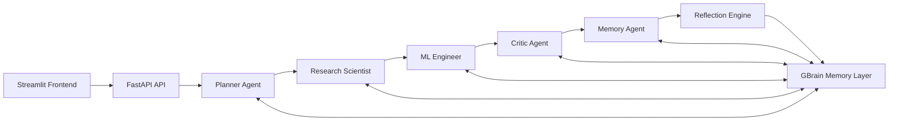
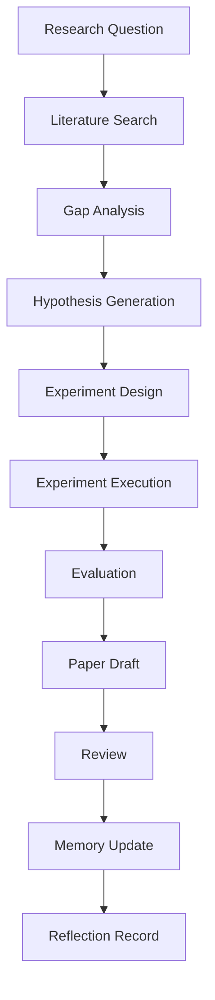
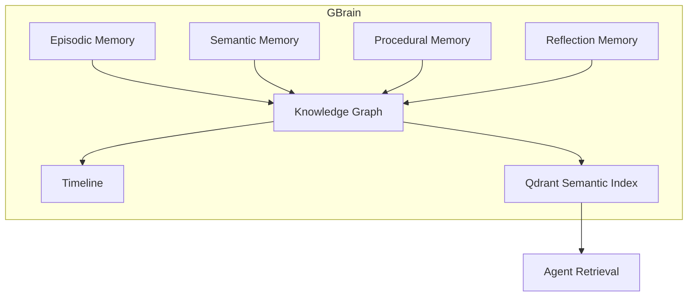

# Autonomous Multi-Agent Research Lab — Architecture

This document explains the project's architecture, key decisions, runtime flow, and deployment notes.

Decision summary
- Runtime: FastAPI orchestrator with synchronous pipeline execution. Simplicity and auditability favored over fully-distributed workers for the initial scaffold.
- Memory: Hybrid GBrain-style design with PostgreSQL for durable records and optional Qdrant for semantic vector search.
- Persistence: PostgreSQL (JSONB) for tasks, memories, experiments and reflections.
- LLMs: Gemini (primary) with a Hermes adapter fallback. The server wrapper retries Gemini and records which provider served each stage.

High-level diagram

Streamlit UI → FastAPI (orchestrator) → Agents (Planner, Research Scientist, ML Engineer, Critic, Memory Agent) → Reflection Engine → Memory (Postgres + optional Qdrant)

Research pipeline (sequential)
- plan: decompose question into a roadmap
- literature_review: search and map prior work
- gap_analysis: identify open problems and limitations
- hypothesis: propose falsifiable claims
- experiment_design: create reproducible experiments
- experiment_execution: simulate or run the experiment scaffold (record artifacts)
- evaluation: assess results and risks
- paper_draft: assemble outline and claims
- review: critic's pass over the draft
- memory_update: persist memories and timeline
- reflection: summarize lessons learned and link to experiments

Provider attribution
- Each stage saved to the task result now includes provider attribution under `stage.artifacts.provider` (e.g., "gemini" or "hermes").
- This helps debugging and monitoring which model served each stage.

Memory design
- Memory records are stored in Postgres (`memories` table) and optionally indexed in Qdrant for semantic retrieval.
- Memory types: episodic, semantic, procedural, reflection. Each memory contains entities and relations for graph-style reasoning.

API surface
- `GET /health` — health snapshot
- `POST /research` — start or enqueue a research pipeline run (returns task id)
- `GET /tasks` — list recent tasks
- `GET /tasks/{task_id}` — retrieve task state and per-stage results
- `GET /memory` — list recent memory records
- `GET /metrics` — Prometheus metrics

Operational notes
- Local development uses Docker Compose (`./scripts/deploy.sh`). Copy `.env.example` → `.env` and edit values before running.
- To initialize DB schema locally or in a Render one-off job, run:

```bash
python3 scripts/create_tables.py
```

- Provider keys: add `GEMINI_API_KEY` or `HERMES_API_KEY` to the environment where the API runs. Do not commit secrets.

Deploying to Render (summary)
- Create a managed Postgres instance and set `DATABASE_URL` in the backend service env.
- Create two Web Services pointing to `Dockerfile` (backend) and `Dockerfile.frontend` (Streamlit) respectively.
- Configure `API_BASE_URL` in the frontend to point to the backend public URL.
- Run the DB init script as a one-off job or use Render's startup commands.

Where to look in the code
- `app/orchestration/pipeline.py` — pipeline orchestration and per-stage persistence.
- `app/agents/*.py` — agent implementations (planner, research_scientist, ml_engineer, critic, memory_agent).
- `app/agents/hermes.py` — LLM adapters and Gemini-first wrapper with retries.
- `app/memory/gbrain.py` — local GBrain implementation and Qdrant integration.
- `frontend/streamlit_app.py` — UI and polling logic that renders per-stage results.

Operational checklist
1. Ensure required env vars are set: `DATABASE_URL`, `API_BASE_URL` (frontend), optional `GEMINI_API_KEY`, `HERMES_API_KEY`, `QDRANT_URL`.
2. Deploy backend and frontend services.
3. Run DB init script.
4. Submit a test `POST /research` and inspect logs for `stage_start` / `stage_complete` and `llm_response` lines.
# Autonomous Multi-Agent Research Lab Architecture

## Decision Summary

| Choice | Options Compared | Decision | Rationale |
| --- | --- | --- | --- |
| Agent runtime | Single monolith, queue workers, provider adapters | FastAPI orchestrator with Hermes and Gemini adapters | Runs locally now and can delegate reasoning to Hermes or Gemini when credentials are configured. |
| Memory | Vector-only, graph-only, hybrid | GBrain-style hybrid graph plus Qdrant vector index | Supports semantic retrieval, entity relationships, timelines, and durable audit records. |
| Persistence | Files, SQLite, PostgreSQL | PostgreSQL | Production-ready JSONB, indexing, relational task/experiment audit trail. |
| Coordination | Fully autonomous infinite loop, explicit pipeline | Explicit research pipeline with reflection loop | Safer, auditable, and easier to test while still self-improving after every task. |

## Agent Organization



## Research Pipeline



## Memory Architecture



## API Endpoints

| Method | Path | Purpose |
| --- | --- | --- |
| `GET` | `/health` | Agent and persistence health snapshot. |
| `POST` | `/research` | Run the full autonomous research pipeline. |
| `GET` | `/tasks` | Inspect recent task state. |
| `GET` | `/memory` | Inspect recent GBrain memory records. |
| `GET` | `/metrics` | Prometheus metrics. |

## Frontend

The Streamlit frontend is a thin operational client over the FastAPI service. It provides:

- Research run submission.
- Pipeline output review.
- Task table.
- Memory browser.
- Health and Prometheus metrics view.

## Database Schema

The SQL schema is in `infra/postgres/001_schema.sql` and includes:

- `tasks`: pipeline state and final results.
- `memories`: episodic, semantic, procedural, and reflection records with graph entities and relations.
- `reflections`: lessons learned, mistakes, and improvement opportunities after each completed task.
- `experiments`: metrics and artifacts for experiment execution.

## Operations

1. Copy `.env.example` to `.env`.
2. For local `uvicorn`, keep `DATABASE_URL`, `REDIS_URL`, and `QDRANT_URL` on `localhost`.
3. To use Gemini instead, set `LLM_PROVIDER=gemini`, `GEMINI_API_KEY`, and optional `GEMINI_MODEL`.
4. Configure `HERMES_API_KEY` and optional `GBRAIN_BASE_URL` when available.
5. Run `./scripts/deploy.sh`; Docker Compose overrides database, Redis, and Qdrant URLs to internal service names.
6. Open `http://localhost:8000/docs`.
7. Open the Streamlit frontend at `http://localhost:8501`.
8. Monitor Prometheus at `http://localhost:9090`.
