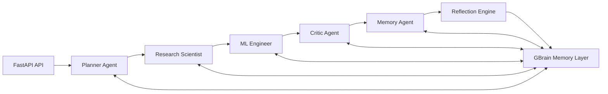
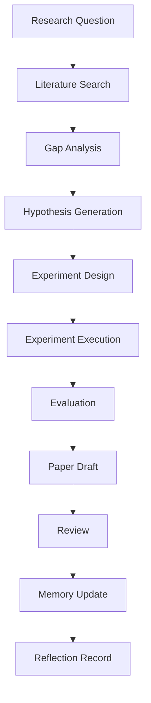
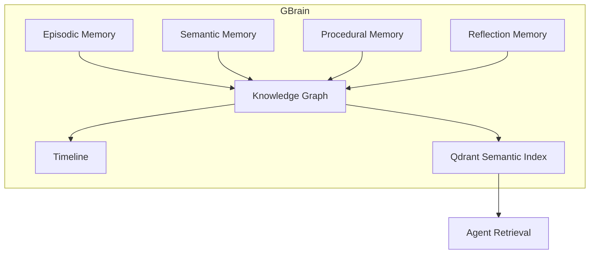

# Autonomous Multi-Agent Research Lab Architecture

## Decision Summary

| Choice | Options Compared | Decision | Rationale |
| --- | --- | --- | --- |
| Agent runtime | Single monolith, queue workers, Hermes adapter | FastAPI orchestrator with Hermes adapter | Runs locally now and can delegate reasoning to Hermes when credentials are configured. |
| Memory | Vector-only, graph-only, hybrid | GBrain-style hybrid graph plus Qdrant vector index | Supports semantic retrieval, entity relationships, timelines, and durable audit records. |
| Persistence | Files, SQLite, PostgreSQL | PostgreSQL | Production-ready JSONB, indexing, relational task/experiment audit trail. |
| Coordination | Fully autonomous infinite loop, explicit pipeline | Explicit research pipeline with reflection loop | Safer, auditable, and easier to test while still self-improving after every task. |

## Agent Organization

## Research Pipeline

## Memory Architecture

## API Endpoints

| Method | Path | Purpose |
| --- | --- | --- |
| `GET` | `/health` | Agent and persistence health snapshot. |
| `POST` | `/research` | Run the full autonomous research pipeline. |
| `GET` | `/tasks` | Inspect recent task state. |
| `GET` | `/memory` | Inspect recent GBrain memory records. |
| `GET` | `/metrics` | Prometheus metrics. |

## Database Schema

The SQL schema is in `infra/postgres/001_schema.sql` and includes:

- `tasks`: pipeline state and final results.
- `memories`: episodic, semantic, procedural, and reflection records with graph entities and relations.
- `reflections`: lessons learned, mistakes, and improvement opportunities after each completed task.
- `experiments`: metrics and artifacts for experiment execution.

## Operations

1. Copy `.env.example` to `.env`.
2. Configure `HERMES_API_KEY` and optional `GBRAIN_BASE_URL` when available.
3. Run `./scripts/deploy.sh`.
4. Open `http://localhost:8000/docs`.
5. Monitor Prometheus at `http://localhost:9090`.
